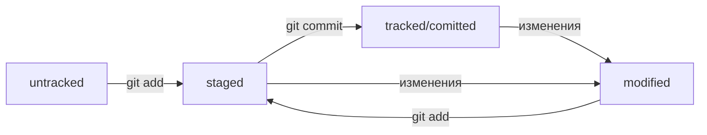

# Шпаргалка по Git

###### Выполнено по курсу ["Основы работы с git"](https://practicum.yandex.ru/git-basics/) от Яндекс Практикум


**Система контроля версий**, или **VCS**, — это программное обеспечение, которое помогает отслеживать изменения в программах, текстовых файлах, больших документах, веб-сайтах и так далее. 

**Git** — один из примеров системы контроля версий: он позволяет хранить, изменять и анализировать историю проекта. Это программа, которая в том числе может работать из *командной строки*. Любой графический интерфейс для Git всего лишь преобразует клики пользователя в вызовы программы.

**Командная строка** (англ. *Command-line Interface*, или *CLI*) — текстовый интерфейс. Пользователь вводит в неё команды. Она принимает их от пользователя и выполняет. Эта строка — обычная программа на компьютере.

## Шпаргалка. Базовые команды в консоли

### Навигация
* ```pwd``` (от англ. *print working directory*, «показать рабочую папку») — покажи, в какой я папке;
* ```ls``` (от англ. *list directory contents*, «отобразить содержимое директории») — покажи файлы и папки в текущей папке;
* ```ls -a``` — покажи также скрытые файлы и папки, названия которых начинаются с символа .;
* ```cd first-project``` (от англ. *change directory*, «сменить директорию») — перейди в папку ```first-project```;
* ```cd first-project/html``` — перейди в папку ```html```, которая находится в папке ```first-project```;
* ```cd ..``` — перейди на уровень выше, в родительскую папку;
* ```cd ~``` — перейди в домашнюю директорию (/Users/Username);
* ```cd /``` — перейди в корневую директорию.

### Работа с файлами и папками
#### Создание
* ```touch index.html``` (англ. *touch*, «коснуться») — создай файл ```index.html``` в текущей папке;
* ```touch index.html style.css script.js``` — если нужно создать сразу несколько файлов, можно напечатать их имена в одну строку через пробел;
* ```mkdir second-project``` (от англ. *make directory*, «создать директорию») — создай папку с именем ```second-project``` в текущей папке.
#### Копирование и перемещение
* ```cp file.txt ~/my-dir``` (от англ. *copy*, «копировать») — скопируй файл в другое место;
* ```mv file.txt ~/my-dir``` (от англ. *move*, «переместить») — перемести файл или папку в другое место.
#### Чтение
* ```cat file.txt``` (от англ. *concatenate and print*, «объединить и распечатать») — распечатай содержимое текстового файла ```file.txt```.
#### Удаление
* ```rm about.html``` (от англ. *remove*, «удалить») — удали файл ```about.html```;
* ```rmdir images``` (от англ. *remove directory*, «удалить директорию») — удали папку ```images```;
* ```rm -r second-project``` (от англ. *remove*, «удалить» + *recursive*, «рекурсивный») — удали папку ```second-project``` и всё, что она содержит.
#### Запись
* ```echo "строка или переменная"``` (англ. «эхо») - вывести в консоль то, что передано в качестве параметра.
* ```>``` - перенаправить вывод команды в файл с полной перезаписью этого файла.
* ```>>``` - перенаправить вывод команды в файл, при этом дописать выыод в конец к содержимому файла.

### Полезные возможности
* Команды необязательно печатать и выполнять по очереди. Можно указать их списком — разделить двумя амперсандами (```&&```).

* У консоли есть собственная память — буфер с несколькими последними командами. По ним можно перемещаться с помощью клавиш со стрелками вверх (```↑```) и вниз (```↓```).

* Чтобы не вводить название файла или папки полностью, можно набрать первые символы имени и дважды нажать ```Tab```. Если файл или папка есть в текущей директории, командная строка допишет путь сама.

---

### Основные команды Git

#### Инициализация репозитория
* ```git init``` (от англ. *initialize* — «инициализировать») - инициализировать репозиторий в текущей папке, из которой вызвана команда.

#### Синхронизация локального и удалённого репозиториев
* ```git remote add origin 'cсылка на GitHub репозиторий'``` - привязать удалённый репозиторий к локальному.
* ```git remote -v```  (англ. *verbose* «подробный») - убедиться, что репозитории связаны.

#### Клонирование чужого репозитория
* ```git clone git@github.com:YandexPraktikum/first-project.git``` (от англ. *clone*, «клон», «копия») — склонировать репозиторий с URL ```first-project.git``` из аккаунта ```YandexPraktikum``` на локальный компьютер.

#### Подготовка файла к коммиту
* ```git add todo.txt``` - добавить файл ```todo.txt``` к сохранению.
* ```git add --all``` (от англ. *add* — «добавить» + от англ. *all* — «всё») - подготовить к сохранению все файлы в репозитории.
* ```git add .``` - добавить к сохранению всю текущую папку.

#### Создание коммита
* ```git commit -m "some message"``` (от англ. *message* — «сообщение») - сделать коммит, который позволит сохранить изменения в истории. Ключ ```-m``` позволяет присвоить коммиту сообщение.

#### Работа с удалённым репозиторием
* ```git push -u origin my-branch``` (от англ. *push*, «толкнуть», «протолкнуть») — отправить новую ветку ```my-branch``` в удалённый репозиторий и связать локальную ветку с удалённой, чтобы при дополнительных коммитах можно было писать просто ```git push``` без ```-u```.
* ```git push --set-upstream origin HEAD``` - команда, аналогичная предыдущей.
* ```git push my-branch``` — отправь дополнительные изменения в ветку ```my-branch```, которая уже существует в удалённом репозитории.
* ```git push``` - отправить изменения на удалённый репозиторий из текущей ветки.
* ```git push --force``` (англ. «сила», «заставить») - форсированный пуш, то есть отправить изменения на удалённый репозиторий из текущей ветки, при этом (в случае ```non-fast-forward```) выкинуть отличающиеся коммиты из удаленной ветки.
* ```git pull``` (от англ. *pull*, «вытянуть») — подтянуть изменения текущей ветки из удалённого репозитория.

#### Добавление изменений в последний коммит
* ```git commit --amend --no-edit``` - дополнить последний (HEAD) коммит новыми файлами, сообщение к коммиту останется таким, каким и было.
* ```git commit --amend -m "Обновлённое сообщение коммита"``` - изменить сообщение к последнему коммиту.

#### Просмотр информации о коммитах
* ```git log``` (от англ. *log* — «журнал [записей]») - просмотреть историю коммитов.
* ```git log --oneline```  (англ. «одной строкой») - получить сокращённый лог. В терминале появятся только первые несколько символов хеша каждого коммита и их комментарии.
* ```git log --graph --oneline``` - ивзуализировать в консоли историю веток и коммитов.

#### Просмотр состояния файлов
* ```git status``` (от англ. *status* — «статус», «состояние») - проверить статус, или состояние, репозитория.

#### «Откат» файлов и коммитов
* ```git restore --staged <file>``` (от англ. *restore* — «восстановить») - убрать файл из статуса *staging*.
* ```git restore --staged .``` - сбросить из *staging* всю текущую папку.
* ```git reset --hard <commit hash>``` (от англ. *reset*  — «сброс», «обнуление» и hard — «суровый») - «откатить» коммит (данный коммит просто удаляется).
* ```git restore <file>``` - «откатить» изменения, которые не попали ни в staging, ни в коммит. Изменения в файле «откатятся» до последней версии, которая была сохранена через ```git commit``` или ```git add```.

#### Просмотр изменений
* ```git diff``` (от англ. *difference* — «отличие», «разница») - сравнить последнюю закоммиченную версию файла с той, что находится в состоянии ```modified```.
* ```git diff --staged``` - показать изменения в ```staged```-файлах относительно последних закоммиченных версий.
* ```git diff <коммит1> <коммит2>``` - сравнивать изменения в двух коммитах (вместо хеша последнего коммита можно использовать ```HEAD```).
* ```git diff main HEAD``` (от англ. *difference*, «отличие», «разница») — показать разницу между веткой ```main``` и указателем на ```HEAD```.
* ```git diff HEAD~2 HEAD``` — показать разницу между тем коммитом, который был два коммита назад, и текущим.

#### Создание веток
* ```git branch feature/the-finest-branch``` (от англ. *branch*, «ветка») — создать ветку от текущей с названием ```feature/the-finest-branch```.
* ```git checkout -b feature/the-finest-branch``` — создать ветку ```feature/the-finest-branch``` и сразу переключиться на неё.

#### Переименование веток
* ```git branch -M main``` - переименовать главную ветку из ```master``` в ```main```.

#### Навигация по веткам
* ```git branch``` (от англ. *branch*, «ветка») — показать, какие есть ветки в репозитории и какая из них текущая (будет отмечена символом ```*```).
* ```git branch -a``` — показать все известные ветки, как локальные (в локальном репозитории), так и удалённые (в ```origin```, или на GitHub).
* ```git checkout feature/br``` — переключиться на ветку ```feature/br```.

#### Удаление веток
* ```git branch -d br-name``` — удалить ветку ```br-name```, но только если она является частью ```main```.
* ```git branch -D br-name``` — удалить ветку ```br-name```, даже если она не объединена с ```main```.

#### Слияние веток
* ```git merge main``` (от англ. *merge*, «сливать», «поглощать») — объединить ветку ```main``` с текущей активной веткой. 
* ```git merge --no-edit --no-ff br-name``` - объединить ветку ```br-name``` с текущей активной веткой, при этом отключить ввод сообщения для merge-коммита и отключить fast-forward слияние веток (будет один merge-коммит).

### Генерация SSH-ключа

**SSH** (от англ. *Secure Shell Protocol*) - сетевой протокол, обеспечивающий безопасный обмен данными в сети. С помощью этого протокола можно получать данные с удалённого компьютера или отправлять их на него. Трафик шифруется, поэтому протокол безопасен.

SSH использует пару ключей для обеспечения безопасности — публичный и приватный:

* **Приватный ключ** (англ. *private key*) хранится только на вашем компьютере и не должен передаваться кому-либо ещё. Он используется для расшифровки данных.
* **Публичный ключ** (англ. *public key*) доступен всем и используется для шифрования данных. Они могут быть расшифрованы парным приватным ключом.

Только вы можете расшифровать данные с помощью приватного ключа, но любой владелец публичного ключа может их для вас зашифровать. Эти два ключа связаны и образуют **SSH-пару**.

* ```ls -a ~/.ssh``` - проверить наличие SSH-ключа.
* ```ssh-keygen -t ed25519 -C "электронная почта, к которой привязан аккаунт на GitHub" ``` или ```ssh-keygen -t rsa -b 4096 -C "электронная почта, к которой привязан аккаунт на GitHub"``` - сгенерировать SSH-ключ (разными алгоритмами шифрования ```ed25519``` или ```rsa```).

    В директории ```~/.ssh``` будут созданы пара ssh-ключей: публичный ```id_ed25519.pub``` и приватный ```id_ed25519``.
* ```clip < ~/.ssh/id_ed25519.pub``` или ```clip < ~/.ssh/id_rsa.pub``` - скопировать содержимое ключа в буфер обмена.
* Перейти на ***GitHub*** и выбрать пункт **Settings** (англ. «настройки») в меню аккаунта > **SSH and GPG keys** > **New SSH key**. В поле **Key type** (англ. «тип ключа») должно быть **Authentication Key** (англ. «ключ аутентификации»). В поле **Key** скопируйте ваш ключ из буфера обмена.
* ```ssh -T git@github.com``` - проверить правильность ключа.

---
### Дополнительная информация о Git

#### Хеши

Git преобразует информацию о коммитах с помощью алгоритма *SHA-1* и для каждого из них рассчитывает уникальный идентификатор — хеш.

**Хеш** — основной идентификатор коммита
Git хранит таблицу соответствий ```хеш → информация о коммите```. Хеш позволяет узнать всё остальное: автора и дату коммита и содержимое закоммиченных файлов.

Все хеши и таблицу ```хеш → информация о коммите``` Git сохраняет в служебные файлы. Они находятся в скрытой папке ```.git``` в репозитории проекта.

#### HEAD

Файл ```HEAD``` (англ. «голова», «головной») — один из служебных файлов папки ```.git```. Он указывает на коммит, который сделан последним (то есть на самый новый).

Вместо хеша последнего коммита можно написать слово ```HEAD``` — Git вас поймёт.

#### Статусы файлов в Git

* **untracked** (англ. «неотслеживаемый»)

    Так помечаются новые файлы в Git-репозитории. Git «видит», что такой файл существует, но не следит за изменениями в нём.
* **staged** (англ. «подготовленный»)

    После выполнения команды ```git add``` файл попадает в staging area, то есть в список файлов, которые войдут в коммит.
* **tracked** (англ. «отслеживаемый»)

    В него попадают файлы, которые уже были зафиксированы с помощью ```git add``` или ```git commit```.
* **modified** (англ. «изменённый»)

    Содержимое файла отличается с последней сохранённой версией.




#### Игнорирование файлов в Git
Чтобы Git игнорировал такие файлы и не пытался добавить их в репозиторий, нужно создать файл ```.gitignore``` (от англ. *ignore* — «игнорировать») в корне репозитория и записать в него названия игнорируемых файлов.

* **Комментарий** - если строка начинается с ```#```, то это комментарий, и ```.gitignore``` не будет его учитывать.
* **Просто название файла** - Git будет игнорировать файлы с таким именем, причём не только в корне репозитория, но и во всех вложенных папках.
* **Звёздочка (```*```)** - соответствует любой строке, включая пустую. Если символ находится между слешами ```/```, то он заменяет любое название ***одной*** папки.
* **Вопросительный знак (```?```)** - соответствует одному любому символу.
* **Квадратные скобки (```[…]```)** - соответствуют одному символу. При этом символ не любой, а только из списка/диапазона, который указан в скобках.
* **Слеш (```/```)** - указывает на каталоги. Если шаблон в ```.gitignore``` начинается со слеша, то Git проигнорирует файлы или каталоги только в корневой директории. Если шаблон заканчивается слешем, то правило применится только к папке.
* **Парные звёздочки (```**```)** - двойная звёздочка между слешами может соответствовать любому количеству папок (в том числе нулю).
* **Восклицательный знак (```!```)** - с помощью него можно инвертировать любое правило в файле ```.gitignore```.